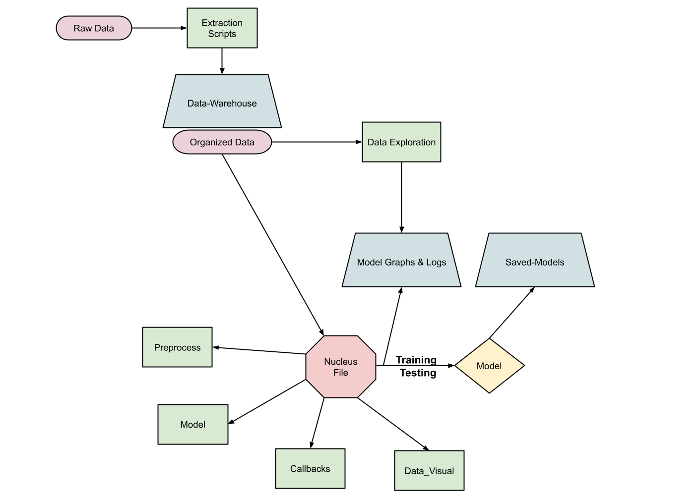
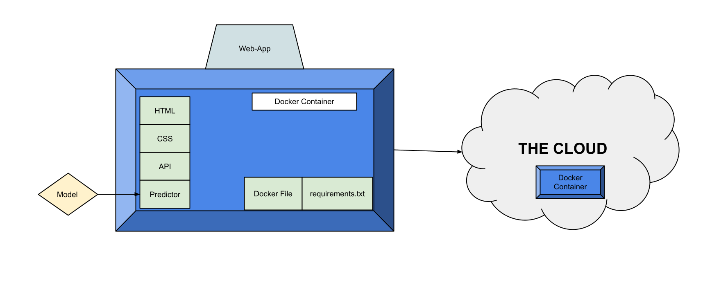

# AJISAI Project README

### Purpose:

The purpose of this project was to create an end-to-end machine learning web application. This was created to gain a
deeper understanding of Python, Machine Learning, Web Scraping, Plotly Graphing, API Developing, Docker, Cloud
Environments, HTML/CSS and production worthy code. I plan on using this project as a long-term medium that I continually
update and use to complete other ML projects in the future. Because of this, I expect there to be many improvements to
come in the following months/years and additions. These improvements would consist of organizing folder structure,
cleaning code, adding new models, updating documentation, and automating tasks if need be. Below are some skills I
utilized in this project:

- Python Code
- Web scraping and Data Extraction
- Data Visualization
- Backend Fast-API Programming
- Docker Containers
- Cloud Environment
- HTML/CSS Web App Development
- Machine Learning Techniques and Models
- Clean, Reusable, Production Worthy Code

### Directory Structure:

- AJISAI-Project
    + Data-Exploration
    + Extraction-Scripts
    + Model-Graphs&Logs
        + Model-Data_{model name}
            + Logs
            + Metric-Graphs
    + Pipeline
        + Baseline_Models
        + Callbacks
        + Data_Visual
        + Models
        + Preprocess
    + Web-Apps
        + Web-App_{model name}
    + X-Misc
        + Blank{n}.py
        + Notes.txt
    + Nucleus_{model name}.py
    + Project_Initializer.py
    + README.md
- /F:/Data-Warehouse
- /F:/Saved-Models

### What The Directories Contain:

- Data-Exploration
    + glob, numpy, os, pandas, PIL, plotly, random
      > - Script that extract useful information and output it to model graphs and logs directory
      > - Used to explore data, stats, correlation coefficients, clustering, etc

- Extraction-Scripts
    + beautifulsoup, glob, os, random, requests, selenium, shutil
      > - Script that extracts data and organizes it into /F:/Data-Warehouse
      > - Data can be extracted from web scraping or downloading of datasets
      > - All data will output to a CSV, Tensorflow Dataframe, json, or images

- Model-Graphs&Logs
    + None
      > - Stores metadata, graphs, logs, model images, json files, and CSV files
      > - Will come from baselines, training, exploration, and prediction processes

- Pipeline\Baseline-Models
    + Keras, SciKitLearn, Tensorflow, numba, numpy, pandas
      > - Will contain basic models used to get baseline of data
      > - Trees, neural nets, machine learning, etc

- Pipeline\Callbacks
    + Keras, sys
      > - Will contain functions used for callbacks on model
      > - Model checkpoints, csv, printing model summaries

- Pipeline\Data-Visual
    + Plotly, SciKitLearn
      > - Visualization scripts that take in history or files and output graphs in the form of HTML files
      > - Data Viz will be broken up into different functions within a single custom library
      > - Will output training, baseline, post-preprocessed, and prediction subplots

- Pipeline\Models
    + Keras, SciKitLearn, Tensorflow
      > - Will contain the actual models and there parameters
      > - Training and grid tuning of model, testing, and displaying plot model
      > - Models will be made using functional API and sequential
      > - Results of training should be outputted to Data Visual directory and logs
      > - Can implement Freezing, Pretrained layers, multiple models, and other techniques

- Pipeline\Preprocess
    + Keras, SciKitLearn, Tensorflow, numba, numpy, os, pandas
      > - Data preprocessing component
      > - Data PP will be broken up into different functions within a single custom library
      > - Generators, feature engineering, dimensionality reduction, and other functions located here

- Web-Apps
    + AWS, Azure, Docker, Fast-API, css, html, jinja, pipreq, plotly, requests, templates
      > - Contains directories for each model web app
      > - Create an application with html, python, and css
      > - Allow user to input data, and model outputs prediction
      > - Put application in docker container
      > - Contains docker file to set up container
      > - Contains requirements.txt to download packages
      > - Container mounted on a cloud platform

- X-Misc
    + Whatever Needed
      > - Contains scratch files and notes for development purposes

- X-Pics
    + None
      > - Contains images for README file

- Nucleus.py
    + custom libraries, datetime, keras, numba, os, sys, tensorflow
      > - A nucleus file executes all functions related to training of model
      > - Will be a complex class that does all the above steps
      > - Will call functions to preprocess, train, visualize, tune, and save model/data

- Project_Initializer.py
    + os
      > - Creates all files and directories needed when starting a new project
      > - Argument that is passed in is name ex. 'dog-cat'

- Data-Warehouse
    + None
      > - Contains data used in projects

- Saved-Models
    + None
      > - Will contain saved model weights

### Logic Steps:

> 1. Use web scraping libraries that extract data online and saves to the Data-Warehouse directory
> 2. Explore data and use visualization libraries to show metadata
> 3. All within the Nucleus file ->
> 4. Preprocess data using different techniques and methods
> 5. Get a baseline of the data and output visualization
> 6. Create and train model using all available techniques and methods
> 7. Output logs and visualization of model training and testing results
> 8. Save model weights and Nucleus file.
> 9. Create a html/css webpage to implement model in
> 10. Create a backend api with Fast-API to be able to take in and serve model results
> 11. Package Web app into Docker container using Docker file
> 12. Place container on cloud platform

### Graph of ML Web-App Creation Pipeline

