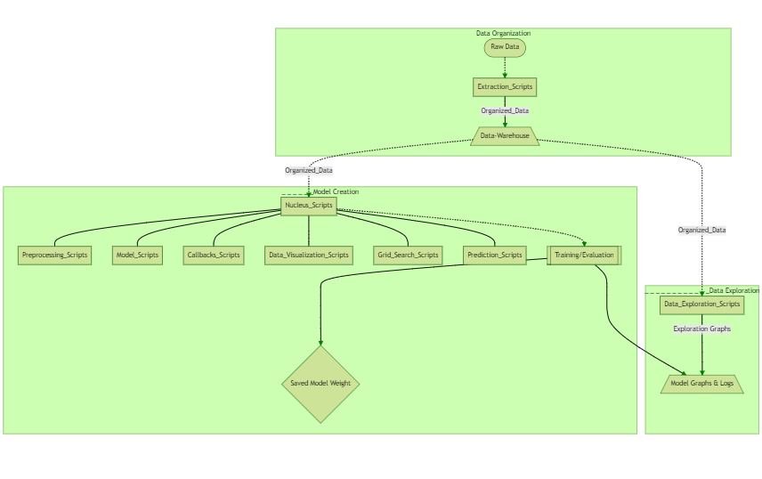
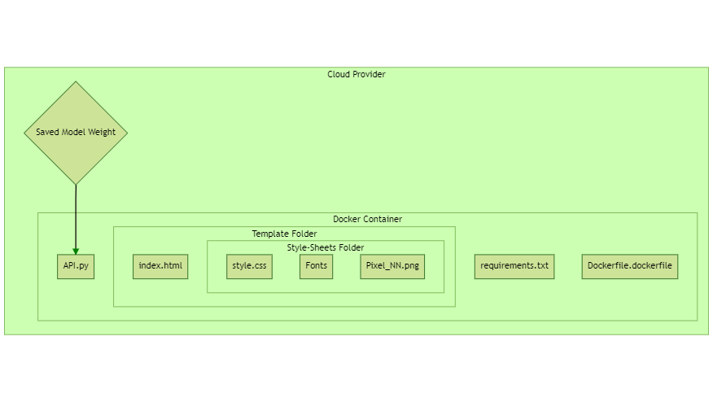

# AJISAI Project README

### The what:

The AJISAI Project can be considered to be a framework or 'Machine Learning Workbench'. It is a directory structure that
separates the different components of the machine learning training, testing, and visualization process all in separate
files. These files (located in the Pipeline directory) are all called on as needed by a Nucleus file. The Nucleus file
can be thought of as the command and control file of a project and executes functions and classes from these other
python files. Graphs, logs, and other model information are also all outputted to the Model-Graphs&Logs folder to help
evaluate the model and view its performance visually. Directories for data extraction and exploration are also present,
although they are not necessarily part of the Nucleus pipeline. A directory to save trained models is also present for
testing and prediction purposes as well as incorporating into ML/DL web applications. Using this kind of pipeline, I can
make any kind of machine or deep learning model I want with varying levels of complexity, efficiency and
professionality.

The Web Application portion of the AJISAI Project contains all the necessary files needed to create an ML/DL web
application within a docker container. Will contain a dockerfile, requirements.txt, html/css files, and API.py file.
{WIP}

### Purpose:

The purpose of this project was to create an end-to-end machine learning web application pipeline in a professional and
organized way. This is a personal project that aims to gain a deeper understanding of Python, Machine Learning, Web
Scraping, Plotly Graphing, API Developing, Docker, Cloud Environments, HTML/CSS and production worthy code. I plan on
using this project as a long-term medium that I continually update and use to complete other ML projects in the future.
Because of this, I expect there to be many improvements to come in the following months/years and additions. These
improvements would consist of organizing folder structure, cleaning code, adding new models, updating documentation, and
automating tasks if need be. Below are some skills I utilized in this project:

- Python Code
- Web scraping and Data Extraction
- Data Visualization
- Backend Fast-API Programming
- Docker Containers
- Cloud Environment
- HTML/CSS Web App Development
- Machine Learning Techniques and Concepts
- Clean, Reusable, Production Worthy Code
- Libraries:

> Numpy, PIL, CV2, Tensorflow, Sci-Kit-Learn, Keras, Plotly, Fast-API, pandas, os, csv, optuna, glob, shutil, and more

### Directory Structure:

- AJISAI-Project
    + Data-Exploration
    + Extraction-Scripts
    + Model-Graphs&Logs
        + Model-Data_{model name}
            + Logs
            + Metric-Graphs
    + Pipeline
        + Callbacks
        + Data_Visual
        + Grid_Search
        + Models
        + Prediction
        + Preprocess
    + Web-Apps
        + Web-App_{model name}
    + X-Misc
        + Mermaid_Code.txt
        + ML-Notes.txt
        + Notes.txt
        + scratch_{n}.py
    + Nucleus_{model name}.py
    + Project_Initializer.py
    + README.md
- /F:/Data-Warehouse
- /F:/Saved-Models

### What The Directories Contain:

- Data-Exploration
  > + Script that extract useful information from data and output it to plotly html files
  > + Used to explore and display data, stats, correlation coefficients, clustering, etc

- Extraction-Scripts
  > + Script that extracts data and organizes it into /F:/Data-Warehouse
  > + Data can be extracted from web scraping or organize downloaded datasets
  > + All data will output to a CSV, Tensorflow Dataframe, json, or image file

- Model-Graphs&Logs
  > + Stores metadata, graphs, logs, model images, json files, and CSV files
  > + Data comes from baseline, training, exploration, and prediction processes

- Pipeline\Callbacks
  > + Will contain functions used for callbacks on model
  > + Model checkpoints, csv, printing model summaries

- Pipeline\Data-Visual
  > + Visualization scripts that take in history or files and output graphs in the form of HTML files
  > + Data Viz will be broken up into different functions within a single custom library
  > + Will output training, baseline, post-preprocessed, and prediction subplots

- Pipeline\Models
  > + Contains the actual models and there parameters
  > + Models will be made using functional API and sequential
  > + Results of training should be outputted to Data Visual directory and logs
  > + Can implement Freezing, Pretrained layers, multiple models, and other techniques

- Pipeline\Preprocess
  > + Data preprocessing component
  > + Data PP will be broken up into different functions within a single custom library
  > + Generators, feature engineering, dimensionality reduction, and other functions located here

- Web-Apps
  > + Contains directories for each model web app
  > + Create an application with html, python, and css
  > + Allow user to input data, and model outputs prediction
  > + Put application in docker container
  > + Contains docker file to set up container
  > + Contains requirements.txt to download packages
  > + Container mounted on a cloud platform

- X-Misc
  > + Contains mermaid code used to create README images
  > + Contains images for README file

- Nucleus.py
  > + A nucleus file executes all functions related to training of model
  > + Will be a complex class that does all the above steps
  > + Will call functions to preprocess, train, visualize, tune, and save model/data

- Project_Initializer.py
  > + Creates all files and directories needed when starting a new project
  > + Argument that is passed in is name ex. 'dog-cat'

- F:\Data-Warehouse
  > + Contains data used in projects

- F:\Saved-Models
  > + Will contain saved model weights

### Logic Steps:

> 1. Use web scraping libraries that extract data online and saves to the Data-Warehouse directory
> 2. Explore data by using visualization libraries to show metadata
> 3. Preprocess data and make it digestible for the model
> 4. Create a baseline model/callbacks then visualize results
> 5. Use Optuna to fine tune model
> 6. Evaluate model by visualization
> 7. Use model to predict on data
> 8. Create web app
> 9. Incorporate model into app
> 10. Create a Docker container for the app
> 11. Place on a cloud service

### Graph of ML Web-App Creation Pipeline

### Graph of ML Web-App

